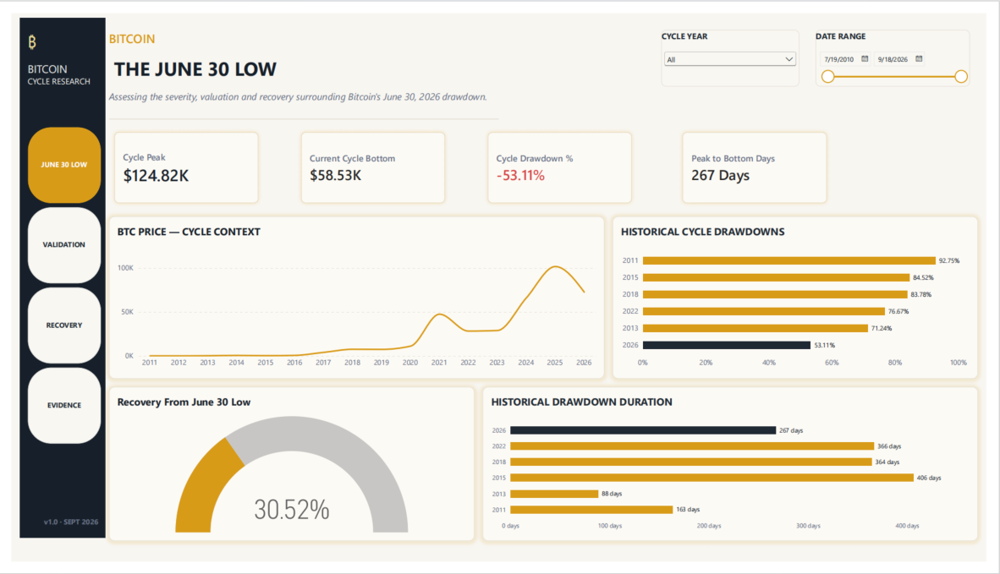
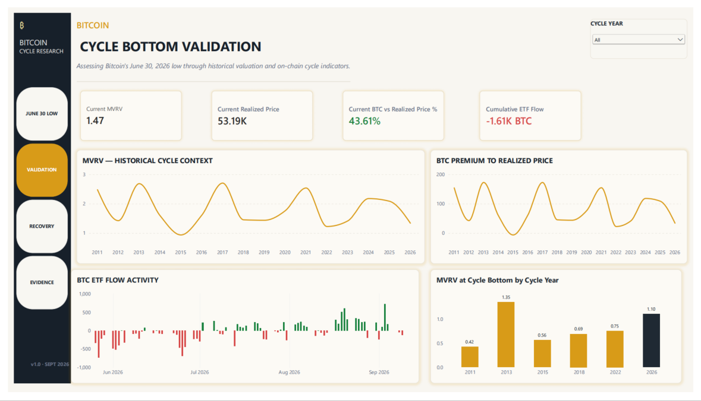
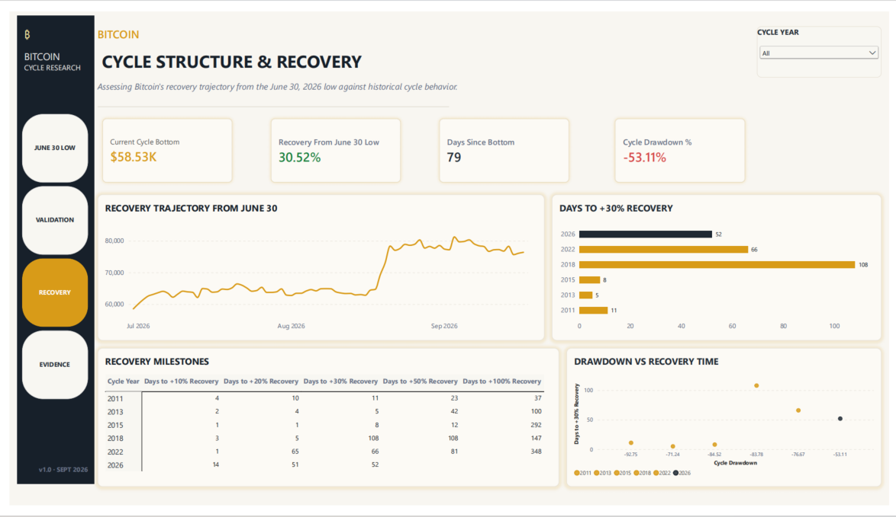
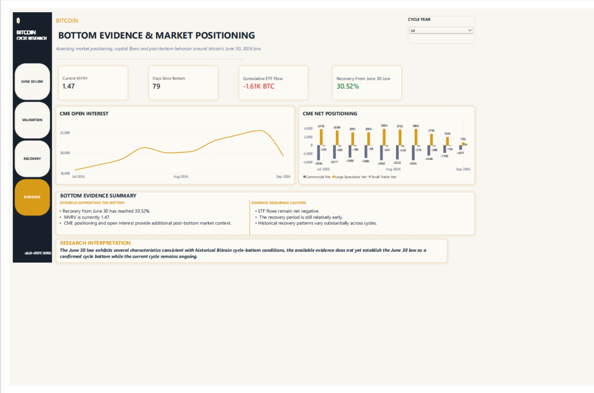

# Bitcoin Cycle Bottom Research — June 30, 2026

## Investment Research • Power BI • On-Chain & Market Analysis

A multi-layer Bitcoin investment research project assessing whether the **June 30, 2026 low** represents a credible cycle-bottom candidate.

The project combines **market structure, on-chain valuation, capital flows, derivatives positioning, and historical cycle analysis** into an investment decision framework built in Power BI.

---

## Dashboard Preview

### 01 — June 30 Low



Focus: cycle peak, drawdown severity, historical drawdowns, recovery and drawdown duration.

### 02 — Cycle Bottom Validation



Focus: MVRV, realized price, ETF flow activity and historical MVRV at cycle bottoms.

### 03 — Cycle Structure & Recovery



Focus: recovery trajectory, historical recovery speed, milestone behavior and drawdown versus recovery time.

### 04 — Bottom Evidence & Market Positioning



Focus: CME open interest and CME net positioning as additional post-bottom market context.

---

## Investment Question

> **Does the evidence surrounding Bitcoin's June 30, 2026 low support treating it as a credible cycle bottom, and what would that imply for crypto exposure?**

The project approaches the question as investment research: identify the evidence, compare it with historical cycle behavior, define what strengthens or weakens the thesis, and establish decision triggers.

---

## Executive Conclusion

The research finds that the **June 30, 2026 low is a credible candidate cycle bottom, but not a confirmed cycle bottom**.

The resulting framework is **measured exposure with confirmation**.

### Key research observations

| Metric | Research observation |
|---|---:|
| Cycle peak | **$124.82K** |
| June 30 cycle bottom | **$58.53K** |
| Peak-to-bottom drawdown | **-53.11%** |
| Recovery from June 30 low | **30.52%** |
| Current MVRV | **1.47** |
| MVRV at June 30 low | **~1.10** |
| Current realized price | **$53.19K** |
| BTC premium to realized price | **43.61%** |
| Cumulative ETF flow in dashboard | **-1.61K BTC** |
| Days since bottom | **79** |

The research treats **$58.53K / the June 30 low as the key invalidation reference** while monitoring recovery, capital flows, valuation and derivatives positioning.

---

## What the Evidence Shows

### Market Structure

Bitcoin declined from the cycle peak of **$124.82K** to approximately **$58.53K**, producing a **53.11% peak-to-bottom drawdown over 267 days**.

The current drawdown is shallower than the historical cycle-bottom drawdowns represented in the project dataset:

- 2011 — 92.75%
- 2013 — 71.24%
- 2015 — 84.52%
- 2018 — 83.78%
- 2022 — 76.67%
- 2026 — 53.11%

Drawdown magnitude is therefore treated as context rather than a standalone confirmation signal.

### On-Chain Valuation

MVRV was approximately **1.10 at the June 30 low** and is approximately **1.47** in the latest dashboard snapshot.

Historical MVRV-at-bottom observations vary substantially across cycles, which is why the project does not apply a single MVRV threshold as a definitive bottom signal.

The current realized price is approximately **$53.19K**, with Bitcoin approximately **43.61% above realized price** in the model.

### Capital Flows

The dashboard records cumulative ETF flow at approximately **-1.61K BTC**.

ETF flows are treated as a confirmation variable rather than a binary buy/sell signal because flow conditions can change materially over short periods.

### Derivatives & Positioning

CME open interest and net positioning provide additional context on participation and positioning following the June 30 low.

These measures are not treated as independently predictive. Their role is to assess whether the price recovery is accompanied by changes in participation and positioning.

---

## Historical Cycle Analysis

The project compares the 2026 recovery with Bitcoin cycles from:

**2011 • 2013 • 2015 • 2018 • 2022**

The time required to reach a **+30% recovery** varies significantly across historical cycles. The 2026 recovery therefore falls within a broad historical distribution rather than establishing a universal confirmation threshold.

Historical comparisons are used as context, not as deterministic forecasts.

---

## Investment Decision Framework

### Evidence that strengthens the bottom thesis

- Sustained recovery from the June 30 low
- Improving spot and ETF capital flows
- Stable or constructive MVRV behavior
- Controlled derivatives leverage
- Confirmation across multiple independent evidence layers

### Evidence that weakens the bottom thesis

- Sustained break below the June 30 / **$58.53K** reference
- Persistent ETF outflows alongside falling price
- Renewed severe valuation compression
- Increasing leverage combined with declining spot price
- Broader deterioration in market and on-chain conditions

The framework is deliberately conditional: new evidence should be allowed to change the assessment.

---

## Research Outputs

### Power BI Model

[Open the Power BI project file](powerbi/Bitcoin_Cycle_Bottom_Research_June_30_2026.pbix)

### Detailed Investment Research Report

[Read the full investment research report](reports/Bitcoin_Cycle_Bottom_Research_Report_June_30_2026.pdf)

### 2-Page Investment Committee Brief

[Read the 2-page investor brief](reports/Bitcoin_Cycle_Bottom_Investment_Brief_June_30_2026.pdf)

### Dashboard

[View the dashboard files](dashboard/)

---

## Methodology

The research combines five evidence layers:

**01 — Market Structure**
- Cycle peak and bottom
- Drawdown magnitude
- Drawdown duration
- Recovery percentage
- Days since bottom

**02 — On-Chain Valuation**
- MVRV
- Realized Price
- BTC premium to realized price
- Historical MVRV at cycle bottoms

**03 — Capital Flows**
- Bitcoin ETF flows
- Cumulative ETF flow
- Historical flow behavior around cycle lows

**04 — Derivatives & Positioning**
- CME open interest
- CME net positioning
- Post-bottom market participation

**05 — Historical Cycle Analysis**
- 2011
- 2013
- 2015
- 2018
- 2022
- 2026

---

## Tools & Technologies

- **Power BI**
- **DAX**
- **Power Query**
- **PostgreSQL**
- **Excel / CSV**
- **GitHub**

---

## Data & External Research

The project combines internally modeled research data with external market and on-chain research.

External research referenced in the project includes:

- Glassnode
- TFTC
- BGeometrics
- Reuters

The detailed report contains the source references and links used for external market context.

---

## Project Structure

```
bitcoin-cycle-bottom-research/
│
├── README.md
│
├── dashboard/
│   ├── Page 1 — June 30 Low
│   ├── Page 2 — Validation
│   ├── Page 3 — Recovery
│   └── Page 4 — Evidence
│
├── reports/
│   ├── Full Investment Research Report
│   └── 2-Page Investment Committee Brief
│
├── powerbi/
│   └── Power BI Research Model
│
└── data/
    └── Supporting project data
```

---

## Important Note

This repository presents an **investment-research framework**, not personalized investment advice.

Historical cycle behavior does not guarantee future outcomes. The conclusion is conditional on the evidence available at the time of analysis and should be reassessed as new market, valuation, flow and positioning data becomes available.

---

## Author

**Bleezysmart**

Financial Analytics • Business Intelligence • Market Research • Bitcoin & Digital Assets
